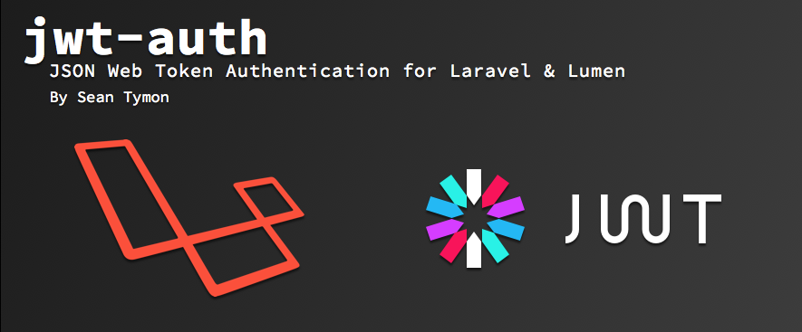
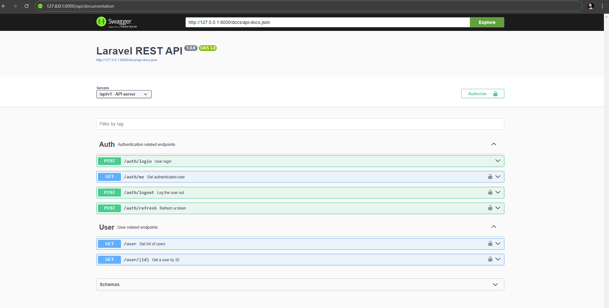
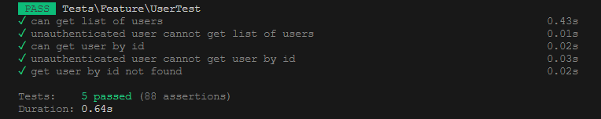

<p align="center"><a href="https://laravel.com" target="_blank"></a> </p> 

* [Instalação do Ambiente Local](#instalação-do-ambiente-local)
  * [Passo 1: Clonar o Repositório](#passo-1-clonar-o-repositório)
  * [Passo 2: Instalar Dependências](#passo-2-instalar-dependências)
  * [Passo 3: Configurar o Arquivo .env](#passo-3-configurar-o-arquivo-env)
  * [Passo 4: Gerar Chave de Aplicativo](#passo-4-gerar-chave-de-aplicativo)
  * [Passo 5: Executar Migrações e Seeds](#passo-5-executar-migrações-e-seeds)
  * [Passo 6: Iniciar o Servidor de Desenvolvimento](#passo-6-iniciar-o-servidor-de-desenvolvimento)
* [Configurações adicionais - Testes](#configurações-adicionais---testes)
  * [Passo 1: Configurar o Arquivo .env.testing](#passo-1-configurar-o-arquivo-envtesting)
  * [Passo 2: Executar Migrações e Seeds](#passo-2-executar-migrações-e-seeds)
* [Configurações adicionais - Pacotes Externos](#configurações-adicionais---pacotes-externos)
  * [Gerar chave secreta](#gerar-chave-secreta)
  * [L5 Swagger](#l5-swagger)
* [Executar os Testes](#executar-os-testes)
* [ ➡️ Considerações (LEIA-ME!) ⬅️](#considerações)

# Instalação do Ambiente Local 
## Passo 1: Clonar o Repositório

Clone o repositório do projeto Laravel já existente para o seu ambiente local. Você pode fazer isso usando um cliente de controle de versão, como o Git, ou simplesmente baixando o código-fonte do projeto em formato de arquivo ZIP.

## Passo 2: Instalar Dependências

Abra o terminal e navegue até a pasta raiz do projeto clonado.
Execute o comando 
```
composer install
``` 
para instalar as dependências do Laravel. Isso irá instalar todas as bibliotecas e pacotes necessários para o funcionamento do projeto Laravel.

## Passo 3: Configurar o Arquivo .env

Faça uma cópia do arquivo .env.example e renomeie-a para .env na pasta raiz do projeto. Pode usar o comando:
```
cp .env.example .env
```
Abra o arquivo .env e configure as variáveis de ambiente necessárias como: <b>Banco de Dados</b> (Foi utilizado o MySQL para esse projeto), nome da aplicação, etc. De acordo com a configuração do seu ambiente local.

## Passo 4: Gerar Chave de Aplicativo

No terminal, execute o comando 
```
php artisan key:generate 
```
para gerar uma nova chave de aplicativo para o projeto Laravel.
Isso irá preencher automaticamente a chave de aplicativo no arquivo .env do projeto.

## Passo 5: Executar Migrações e Seeds

Execute as migrações e seeders para popular o banco de dados, você pode executá-los  usando os comandos respectivamente:
```
php artisan migrate
```
 
```
php artisan db:seed
```
Isso irá criar as tabelas do banco de dados e popular os dados iniciais.

## Passo 6: Iniciar o Servidor de Desenvolvimento

No terminal, execute o comando 
```
php artisan serve 
```
para iniciar o servidor de desenvolvimento do Laravel.
O Laravel irá criar um servidor de desenvolvimento local na porta padrão 8000 (ou outra porta especificada) e você poderá acessar o aplicativo Laravel em seu navegador através do endereço http://localhost:8000 (ou outra porta especificada).

# Configurações adicionais - Testes

## Passo 1: Configurar o Arquivo .env.testing

Faça uma cópia do arquivo .env e renomeie-a para .env.testing na pasta raiz do projeto. Pode usar o comando:
```
cp .env .env.testing
```
Abra o arquivo .env.testing e altere a variável `DB_DATABASE` para apontar para o banco de dados de testes.

## Passo 2: Executar Migrações e Seeds

Execute as migrações e seeders para popular o banco de dados, você pode executá-los  usando os comandos, com parâemtro `--env=testing`, respectivamente:
```
php artisan migrate --env=testing
```
 
```
php artisan db:seed --env=testing
```
Isso irá criar as tabelas do banco de dados de teste e popular os dados iniciais.

# Configurações adicionais - Pacotes Externos



## Gerar chave secreta
Execute um comando auxiliar para gerar uma chave:
```php
php artisan jwt:secret

// Atualize também as variáveis de ambiente de testes
php artisan jwt:secret --env=testing
```

Isso atualizará seu arquivo .env com algo como `JWT_SECRET=foobar`

É a chave que será usada para assinar seus tokens de autenticação.

# L5 Swagger

Para gerar a documentação Swagger/OpenApi para sua API, o Swagger oferece um conjunto de anotações para declarar e manipular a saída. Execute:
```php
php artisan vendor:publish --provider "L5Swagger\L5SwaggerServiceProvider"

php artisan l5-swagger:generate
```
Você poderá visualizar a documentação da sua api em uma rota como: http://127.0.0.1:8000/api/documentation



# Executar os Testes

Por fim execute os testes:
```
php artisan test --env=testing
```


# Considerações
Os recursos que idealizei inicialmente para a aplicação e que não tive tempo ou necessidade de construir para este teste estão ilustrados no diagrama abaixo. Minha prioridade foi atender minimamente todos os pontos solicitados, garantindo uma organização que facilita a compreensão do código e sua personalização.

Os controladores com documentação para o pacote Swagger acabaram ficando com blocos de comentários verbosos. A princípio, pela leitura rápida que fiz do pacote, acredito que não há como fugir muito disso, a não ser que se escreva as documentações diretamente no arquivo JSON final. Para melhorar a visualização dos métodos, recomendo usar o atalho de teclado (<b>IDE VSCode</b>): `Ctrl + K Ctrl + ;` para ocultar os blocos de comentários.

Qualquer dúvidas ou pontos de melhoria, estou a disposição para discutir.
